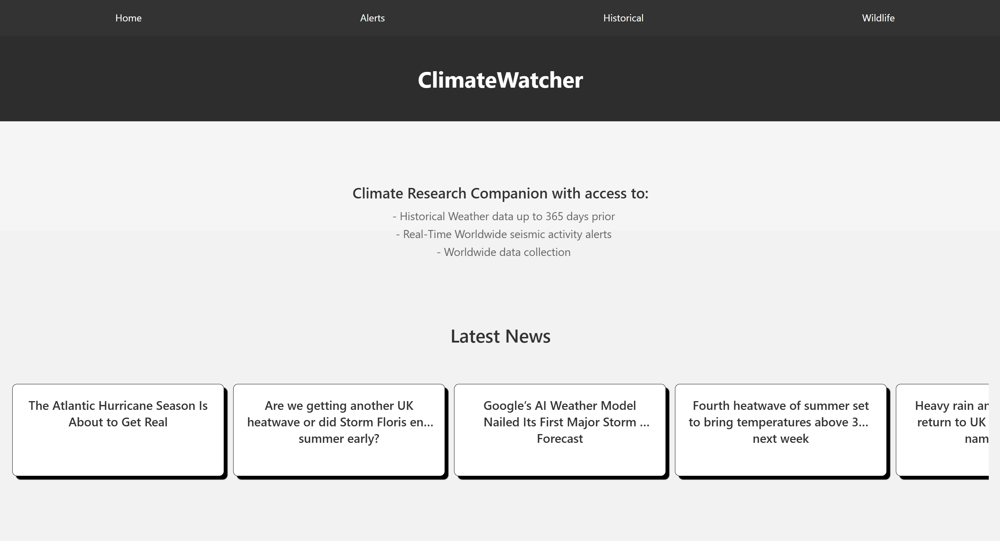
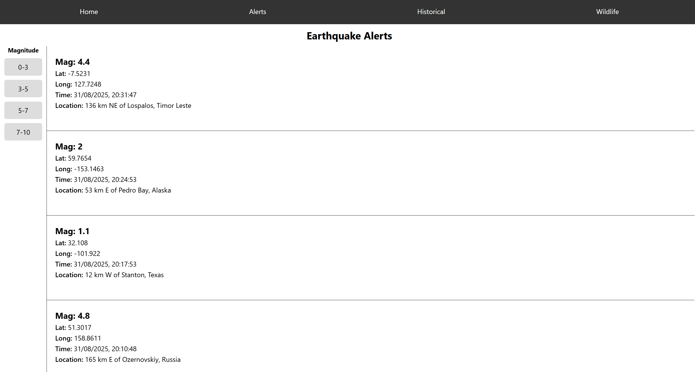
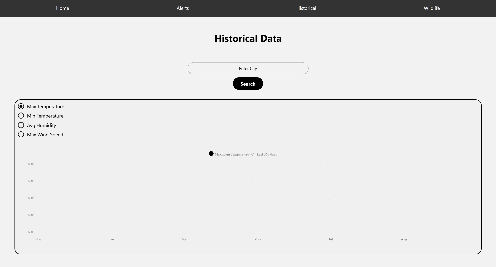
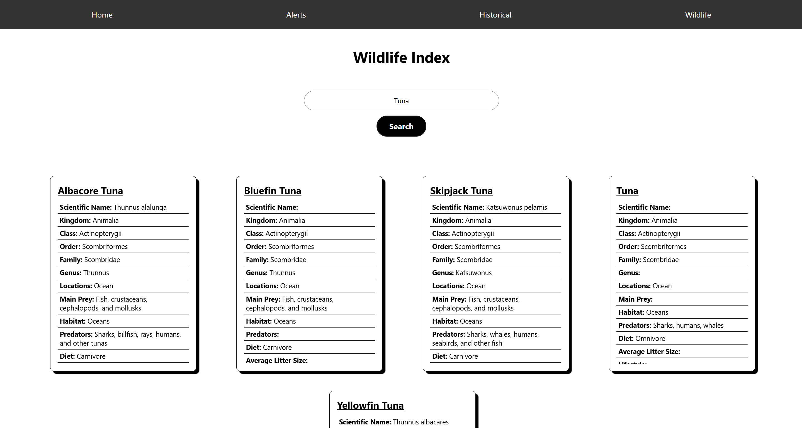

# **🌍 ClimateWatcher: Your Environmental Companion App**

## Project Overview

Welcome to ClimateWatcher, a passion project born from a desire to combine technology with environmental awareness. This full-stack web application, built with React Native, is designed to be an all-in-one resource for understanding our planet. More than just a collection of features, this project represents a deep dive into real-world API integration and a hands-on journey toward mastering modern web development workflows.

## ✨ Key Features
📰 Global Climate News: Stay up-to-date with the latest headlines and trends from the world of climate and sustainability, powered by a dedicated news API.

🚨 Live Seismic Activity: Visualize real-time seismic data with an interactive map, showcasing recent earthquakes around the globe. This feature demonstrates my ability to handle and render dynamic, rapidly changing datasets.

🌡️ Historical Climate Data: Effortlessly look up historical climate information, including minimum/maximum temperatures, humidity, and wind speed for any location worldwide.

🐾 Wildlife Database: Explore a comprehensive animal encyclopedia. This feature displays beautifully formatted information cards with detailed data on various animal species, showcasing my data structuring and presentation skills.

## 🛠️ Technologies & Tools
This project was built with a modern and robust technology stack, showcasing proficiency in a variety of key tools:

Frontend: React Native, JavaScript (ES6+), HTML5, CSS3

Styling: React Native Styling

State Management: React Hooks (useState, useEffect)

Dependency Management: npm

## ⚙️ API Integrations
The true heart of this project lies in its seamless integration with several powerful third-party APIs. This experience was central to the project's development and demonstrates a strong command of fetch and asynchronous JavaScript.

### News API: For fetching and displaying global climate-related news articles.




### Seismic Activity API: For retrieving and rendering real-time earthquake data.




### Climate Data API: For accessing and presenting historical weather information.




### Wildlife Data API: For populating the animal information cards with rich, detailed data.




## 🚀 Getting Started
To get a copy of this project up and running on your local machine, follow these simple steps.

### Prerequisites
```
Node.js (LTS version)
npm
```

### Installation

Navigate to the project directory:
```
  cd ClimateWatcher
```
Install the dependencies:
```
  npm install
```
Start the development server:
```
  npm expo start
```
